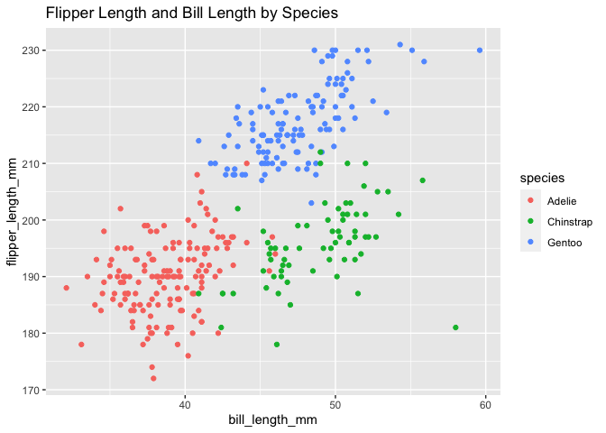

Homework 1
================
Karina Myers

This is my solution to HW1.

``` r
library(tidyverse)
```

    ## ── Attaching packages ─────────────────────────────────────── tidyverse 1.3.0 ──

    ## ✓ ggplot2 3.3.2     ✓ purrr   0.3.4
    ## ✓ tibble  3.0.3     ✓ dplyr   1.0.2
    ## ✓ tidyr   1.1.2     ✓ stringr 1.4.0
    ## ✓ readr   1.3.1     ✓ forcats 0.5.0

    ## ── Conflicts ────────────────────────────────────────── tidyverse_conflicts() ──
    ## x dplyr::filter() masks stats::filter()
    ## x dplyr::lag()    masks stats::lag()

## Problem 1

Create a data frame with the specified element.

``` r
prob1_df =
  tibble(
    samp = rnorm(10),
    samp_gt_0 = samp > 0, 
    char_vec = c("a", "b", "c", "d", "e", "f", "g", "h", "i", "j"), 
    factor_vec = factor(c("low", "low", "low", "mod", "mod", "mod", "mod", "high", "high", "high"))
)
```

Take the mean of each variable in my data frame.

``` r
mean(pull(prob1_df, samp))
```

    ## [1] -0.224768

``` r
mean(pull(prob1_df, samp_gt_0))
```

    ## [1] 0.4

``` r
mean(pull(prob1_df, char_vec))
```

    ## Warning in mean.default(pull(prob1_df, char_vec)): argument is not numeric or
    ## logical: returning NA

    ## [1] NA

``` r
mean(pull(prob1_df, factor_vec))
```

    ## Warning in mean.default(pull(prob1_df, factor_vec)): argument is not numeric or
    ## logical: returning NA

    ## [1] NA

I can take the mean of numbers and logical but not the mean of character
or factor.

Convert to numeric.

``` r
as.numeric(pull(prob1_df, samp_gt_0)) 
as.numeric(pull(prob1_df, char_vec))
as.numeric(pull(prob1_df, factor_vec))
```

I can take take the mean of logical and factor, but not character.
Logical is converted to 0 or 1. Factor is converted to 1, 2, or 3.
However, character is not converted to numbers, which why you cannot
take the mean.

Second chunk of code:

``` r
as.numeric(pull(prob1_df, samp_gt_0)) * (samp = rnorm(10))
as.factor(pull(prob1_df, samp_gt_0)) * (samp = rnorm(10))
as.numeric(as.factor(pull(prob1_df, samp_gt_0))) * (samp = rnorm(10))
```

## Problem 2

``` r
data("penguins", package = "palmerpenguins")
```

The penguins data set examines species, island, bill\_length\_mm,
bill\_depth\_mm, flipper\_length\_mm, body\_mass\_g, sex, year. There
are 344 rows and 8 columns. The mean flipper length is 200.9152047.

``` r
ggplot (data = penguins, aes(x = bill_length_mm, y = flipper_length_mm, color = species)) + geom_point() + ggtitle("Flipper Length and Bill Length by Species")
```

    ## Warning: Removed 2 rows containing missing values (geom_point).

<!-- -->

``` r
ggsave("hw1_scatter_plot.pdf", height = 4, width = 6) 
```

    ## Warning: Removed 2 rows containing missing values (geom_point).
