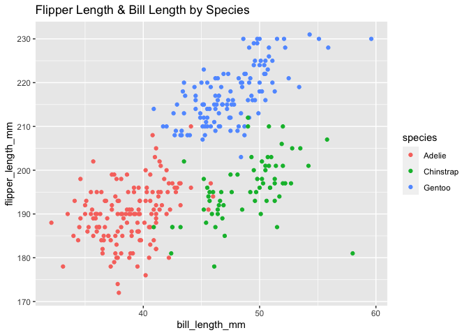

Homework 1
================
Karina Myers

#### Loading tidyverse

``` r
library(tidyverse)
```

    ## ── Attaching packages ───────────────────────────────────────────────────────────────── tidyverse 1.3.0 ──

    ## ✓ ggplot2 3.3.2     ✓ purrr   0.3.4
    ## ✓ tibble  3.0.3     ✓ dplyr   1.0.2
    ## ✓ tidyr   1.1.2     ✓ stringr 1.4.0
    ## ✓ readr   1.3.1     ✓ forcats 0.5.0

    ## ── Conflicts ──────────────────────────────────────────────────────────────────── tidyverse_conflicts() ──
    ## x dplyr::filter() masks stats::filter()
    ## x dplyr::lag()    masks stats::lag()

## Problem 1

#### Create a data frame with the specified elements

``` r
prob1_df =
  tibble(
    samp = rnorm(10),
    samp_gt_0 = samp > 0, 
    char_vec = c("a", "b", "c", "d", "e", "f", "g", "h", "i", "j"), 
    factor_vec = factor(c("low", "low", "low", "mod", "mod", "mod", "mod", "high", "high", "high"))
)
```

#### Take the Mean

``` r
mean(pull(prob1_df, samp))
```

    ## [1] 0.441271

``` r
mean(pull(prob1_df, samp_gt_0))
```

    ## [1] 0.7

``` r
mean(pull(prob1_df, char_vec))
```

    ## Warning in mean.default(pull(prob1_df, char_vec)): argument is not numeric or
    ## logical: returning NA

    ## [1] NA

``` r
mean(pull(prob1_df, factor_vec))
```

    ## Warning in mean.default(pull(prob1_df, factor_vec)): argument is not numeric or
    ## logical: returning NA

    ## [1] NA

I can take the mean of numbers and logical but not the mean of character
or factor.

#### Convert to Numeric

``` r
as.numeric(pull(prob1_df, samp_gt_0)) 
as.numeric(pull(prob1_df, char_vec))
as.numeric(pull(prob1_df, factor_vec))
```

This shows how R coerces logical, character, and factor into numbers.
Logical is converted to 0 or 1. Factor is converted to 1, 2, or 3.
However, character is not converted to numbers. This partially explains
what happened in the step above. Since character could not be coerced to
numbers, R could not take the mean.

#### Second Code Chunk

``` r
#convert the logical vector to numeric, and multiply the random sample by the result
as.numeric(pull(prob1_df, samp_gt_0)) * (samp = rnorm(10))
```

    ##  [1]  0.9634618  0.0000000 -1.1560315  0.7777350  0.0000000  0.6634160
    ##  [7] -0.1545813  0.0000000 -0.8592057 -0.2138898

``` r
#convert the logical vector to a factor, and multiply the random sample by the result
as.factor(pull(prob1_df, samp_gt_0)) * (samp = rnorm(10))
```

    ## Warning in Ops.factor(as.factor(pull(prob1_df, samp_gt_0)), (samp = rnorm(10))):
    ## '*' not meaningful for factors

    ##  [1] NA NA NA NA NA NA NA NA NA NA

``` r
#convert the logical vector to a factor and then convert the result to numeric, and multiply the random sample by the result
as.numeric(as.factor(pull(prob1_df, samp_gt_0))) * (samp = rnorm(10))
```

    ##  [1] -1.3642853  1.5090944 -2.3573769  0.8139822  1.1739951 -2.3302594
    ##  [7]  0.6871164 -1.2089367 -5.3509316  2.3570627

## Problem 2

#### Loading Penguins

``` r
data("penguins", package = "palmerpenguins")
```

The *penguins* data set examines species, island, bill\_length\_mm,
bill\_depth\_mm, flipper\_length\_mm, body\_mass\_g, sex, year. This
data set examines Adelie, Chinstrap, Gentoo speices across three
islands: Biscoe, Dream, Torgersen. The mean bill length is 43.9219298.
Values were measured between the years of 2007, 2009. There are 344 rows
and 8 columns. The mean flipper length is 200.9152047.

#### Scatterplot

``` r
ggplot(data = penguins, aes(x = bill_length_mm, y = flipper_length_mm, color = species)) + 
  geom_point() + 
  ggtitle("Flipper Length & Bill Length by Species")
```

    ## Warning: Removed 2 rows containing missing values (geom_point).

<!-- -->

``` r
ggsave("hw1_scatter_plot.pdf", height = 4, width = 6) 
```

    ## Warning: Removed 2 rows containing missing values (geom_point).
